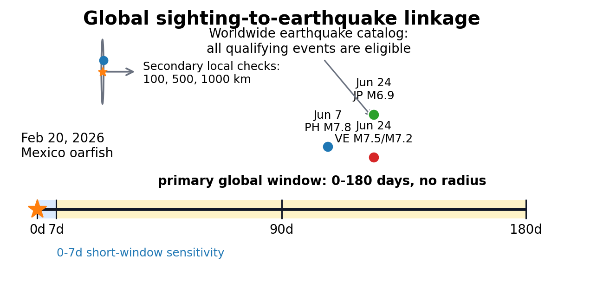
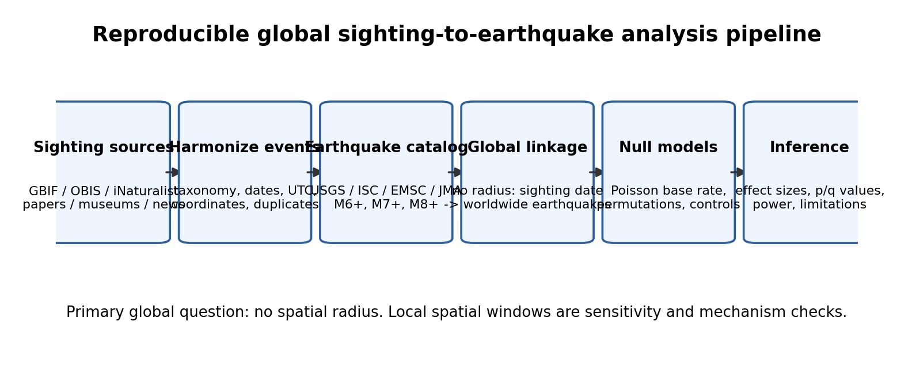
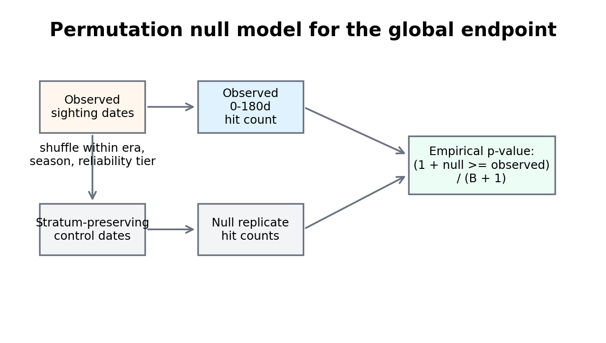
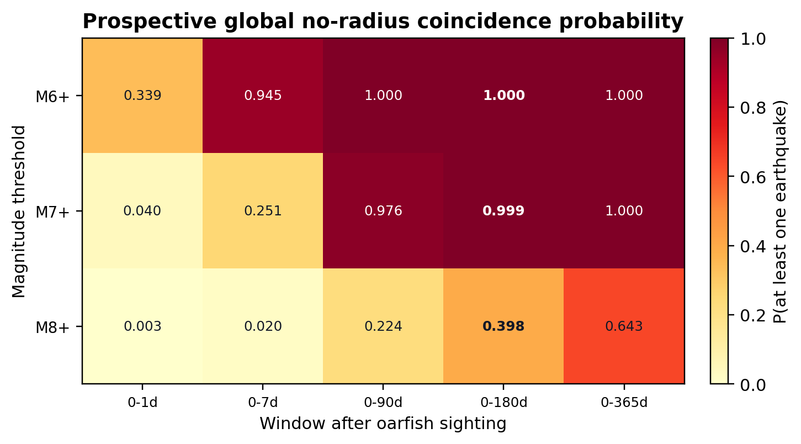
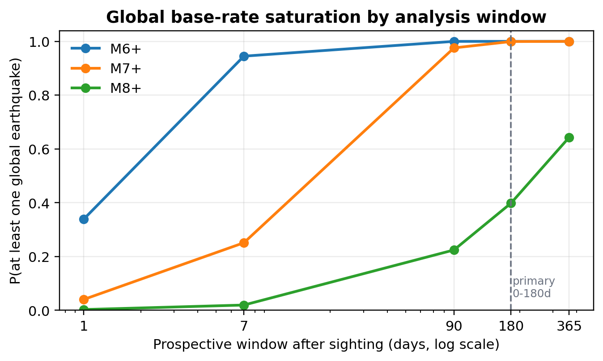
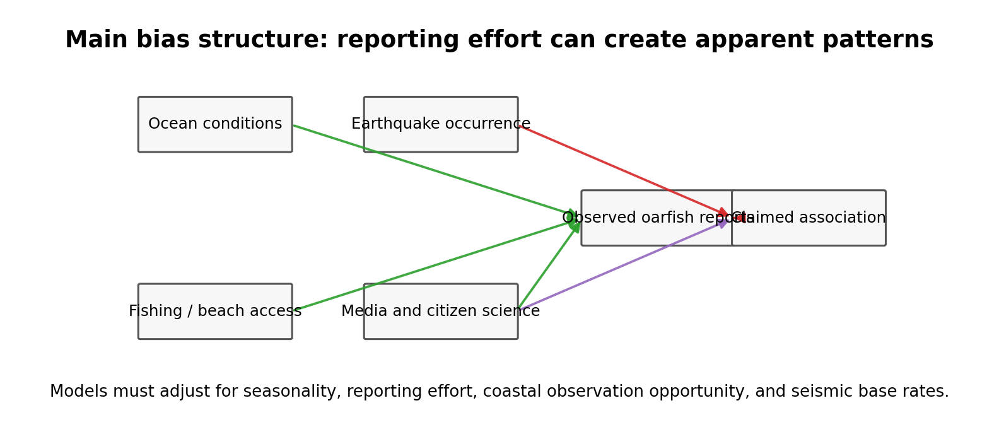

# Oarfish Sightings and Major Earthquakes

**Paper PDF:** [output/pdf/oarfish_acm_paper.pdf](output/pdf/oarfish_acm_paper.pdf)

**Title:** Oarfish Sightings and Major Earthquakes: A Global Sighting-to-Earthquake Evidence Synthesis and Test Design

**Author:** Sho Akiyama, Independent Researcher

**Contact:** contact@akiyamasho.com

This repository contains an ACM-style research manuscript, rendered PDF, figures, and reproducibility scripts for evaluating public claims that oarfish sightings are followed by major earthquakes.

## Abstract

Public accounts often claim that oarfish appearances warn of major earthquakes, but the statistical target of this claim is often ambiguous. This paper separates local biological-precursor hypotheses from the broader public claim that an oarfish sighting anywhere may be followed by a major earthquake somewhere else. For the global claim, the primary diagnostic is sighting-to-earthquake matching with no spatial radius over a `0--180` day prospective window. Shorter `0--1`, `0--7`, and `0--90` day windows are sensitivity checks, while local `100`, `500`, and `1000` km windows are secondary mechanism checks.

The key statistical issue is base-rate saturation. Under a homogeneous Poisson approximation to USGS 1990--2021 earthquake counts, a random date has probability about `1.000` of being followed within 180 days by at least one global `M >= 6` earthquake, `0.999` for `M >= 7`, and `0.398` for `M >= 8`. These base rates mean that broad global temporal matches are expected under chance. Current public evidence does not support treating oarfish sightings as earthquake forecasts.

## Repository Contents

- [Rendered PDF](output/pdf/oarfish_acm_paper.pdf)
- [ACM LaTeX source](output/pdf/oarfish_acm_paper.tex)
- [BibTeX references](output/pdf/references.bib)
- [Figure-generation script](output/pdf/make_figures.py)
- [Generated figures](output/pdf/figures/)
- [Agent instructions](AGENTS.md)

## Research Question

The paper distinguishes three related but different questions:

1. **Global public-warning claim:** Does an oarfish sighting anywhere tend to be followed by a major earthquake anywhere within a long prospective window?
2. **Local mechanism claim:** Is a sighting followed by a nearby earthquake within a short window, consistent with a possible local precursor mechanism?
3. **Descriptive ecology:** What do rare oarfish strandings, bycatch events, and near-surface observations indicate about oarfish biology and reporting patterns?

The manuscript focuses on the first question while preserving local analyses only as secondary checks.

## Primary Endpoint

The proposed confirmatory global endpoint is:

- sighting date: `t_i`
- earthquake catalog: official global earthquake catalogs, preferably USGS FDSN plus cross-catalog checks
- temporal direction: prospective, sighting to later earthquake
- window: `0--180` days
- spatial radius: none
- magnitude thresholds: `M >= 6`, `M >= 7`, and `M >= 8`

Shorter global windows are retained as sensitivity checks:

- `0--1` day
- `0--7` days
- `0--90` days
- `0--365` days only as a saturation diagnostic

Local radii of `100`, `500`, and `1000` km are secondary mechanism checks, not the definition of the global claim.

## Global Linkage Design



The global linkage rule intentionally has no spatial radius. Under this rule, every qualifying earthquake worldwide is eligible after a sighting. That design matches the broad public narrative, but it also creates a severe base-rate problem because large earthquakes occur frequently at global scale.

The manuscript includes a motivating example: a February 20, 2026 oarfish report near Cabo San Lucas, Mexico, followed by June 2026 `M6+` earthquakes in the Philippines, Japan, and Venezuela in the USGS catalog. These are real matches under a global `0--180` day rule, but the base-rate calculations show why such matches are expected for random dates as well.

## Study Pipeline



A defensible reanalysis requires an auditable event-level table rather than a list of anecdotes or articles. The proposed pipeline separates:

- raw sighting sources
- taxonomic, temporal, and spatial harmonization
- accepted Regalecidae sighting events
- official earthquake catalogs
- global `0--180` day linkage tables
- permutation null models
- final tables, figures, and inference

## Oarfish Occurrence Data

The occurrence table should be event-level, not article-level. Required fields include:

- sighting ID
- original and harmonized taxon
- local and UTC observation time
- latitude, longitude, and location text
- country and administrative region
- source type, title, URL or DOI
- observation type and specimen count
- photograph flag and specimen repository
- source reliability tier
- time, spatial, taxonomic, and duplicate uncertainty

Taxonomic harmonization begins at family level, Regalecidae, then checks genus and species terms such as `Regalecus`, `Agrostichthys`, `R. glesne`, and `R. russellii`.

## Source Reliability Tiers

| Tier | Evidence standard | Main use |
| --- | --- | --- |
| 1 | Specimen record, DOI-linked paper, or institutional record with repository ID or photograph | Primary |
| 2 | Government, museum, aquarium, or university report with date and location | Primary |
| 3 | Citizen-science record or news report with image, date, and location | Sensitivity flag |
| 4 | News or social-media report missing one key field but independently corroborated | Sensitivity only |
| 5 | Unsourced repost, vague location, or unresolved taxon/date conflict | Exclude |

News reports, including the February 2026 Mexico example, should not be treated as audited occurrence records unless corroborated by institutional evidence.

## Statistical Model

For sighting `i` on date `t_i`, the global prospective hit indicator for magnitude threshold `M` and window `w` is:

```text
H_i_global(M, w) = 1{exists earthquake j:
                     m_j >= M and 0 <= t_j - t_i <= w}
```

The earthquake may occur anywhere on Earth. The global hit count is the sum of these indicators across accepted sighting events.

For local secondary checks, the indicator adds a distance constraint:

```text
H_i_local(M, w, R) = 1{exists earthquake j:
                      m_j >= M,
                      0 <= t_j - t_i <= w,
                      distance(i, j) <= R}
```

with `R` in `{100, 500, 1000}` km.

## Null Model



The key test is not whether a memorable sighting can be followed by a memorable earthquake. It is whether observed hit counts exceed a matched null distribution. The proposed permutation tests preserve reporting structure by shuffling dates within strata such as:

- reporting era
- month or season
- source-reliability tier
- region or seismic-hazard stratum for local analyses

The empirical upper-tailed p-value is:

```text
p = (1 + number of null replicates with H_b >= H_observed) / (B + 1)
```

## Baseline Calculations

The manuscript uses USGS public annual counts for 1990--2021 as a diagnostic approximation:

- `M6.0--6.9`: 4,360 earthquakes
- `M7.0--7.9`: 450 earthquakes
- `M8.0+`: 33 earthquakes

Under a homogeneous Poisson approximation, the probability that a random date is followed within `w` days by at least one global earthquake is:

```text
P(at least one earthquake) = 1 - exp(-lambda * w)
```

| Window | `M6+` | `M7+` | `M8+` |
| --- | ---: | ---: | ---: |
| `0--1` day | 0.339 | 0.040 | 0.003 |
| `0--7` days | 0.945 | 0.251 | 0.020 |
| `0--90` days | 1.000 | 0.976 | 0.224 |
| `0--180` days | 1.000 | 0.999 | 0.398 |

These are diagnostic base-rate calculations, not inferential p-values.



The result is straightforward: with no spatial restriction and a six-month window, `M6+` and `M7+` matches are nearly guaranteed. A broad global match is therefore weak evidence unless it exceeds a carefully matched null.

The repository also includes a line-plot version of the same saturation pattern:



## Bias and Validity



Apparent association can be created by non-seismic processes:

- oceanographic conditions affecting oarfish appearances
- fishing effort and beach access affecting observation probability
- media and citizen-science attention affecting report probability
- earthquake salience affecting retrospective linkage

Raw sighting counts should not be interpreted as biological rates without reporting-effort adjustment.

## Interpretation

The best directly relevant peer-reviewed evidence remains negative for a local short-term precursor claim in the Japanese multi-taxon setting. The global six-month claim is different, but it is not easier to defend because long-window worldwide earthquake matches are expected by chance.

A positive future result would need to show excess hit counts over matched controls, survive reporting-effort adjustment, and replicate across source-reliability strata. The most useful next step is therefore not more anecdotes, but an auditable master table and predeclared tests.

## Conclusion

Current public evidence does not support using oarfish sightings as earthquake forecasts. For the global sighting-to-earthquake claim, the baseline probability of a worldwide `M6+` or `M7+` earthquake within six months is already extremely high. A defensible 1980--2026 study requires audited Regalecidae events, official earthquake catalogs, an explicit `0--180` day global endpoint, shorter-window sensitivity checks, secondary local endpoints, source-reliability tiers, covariate adjustment, and permutation null models.

## Build

From the repository root:

```bash
python output/pdf/make_figures.py
latexmk -pdf -interaction=nonstopmode -halt-on-error -outdir=output/pdf output/pdf/oarfish_acm_paper.tex
```

The final PDF was rendered with TeX Live 2026 and visually checked with Poppler page images.

## Notes for Future Agents

See [AGENTS.md](AGENTS.md). In particular:

- keep the primary endpoint as global `0--180` days with no radius
- do not reintroduce `30` days as an active endpoint
- treat `30 days and 100 km` only as historical context for Orihara et al.
- keep news-sourced sightings in lower evidence tiers unless institutionally corroborated
